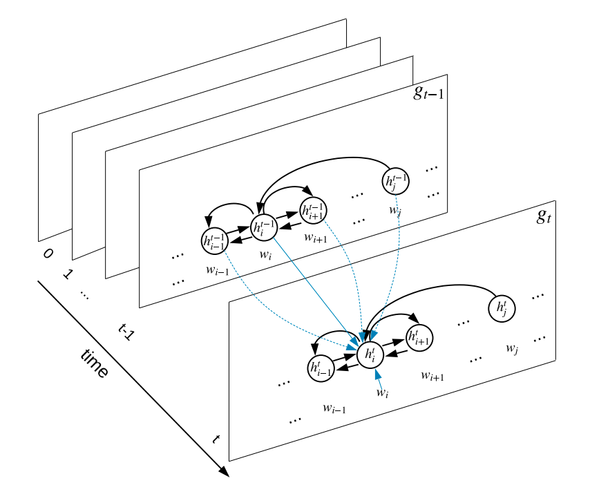

## Pytorch Implementation for Document-level Relation Extraction with Graph State LSTM and Contextual Word Embedding

### Introduction

We address the problem of Document-Level N-ary Relation Extraction with a graph-based Long-short term memory network that utilizes a unified dependency-structure of a document, combined with state of the art pre-trained contextual embedding for the Biomedical Domain.

Our model was trained in a end-to-end manner and use whole information from all mention pairs in the document to make the final prediction



### Dataset

We use BioCreative5 CDR to train, develop and evaluate our model. The CDR5 dataset contains 1500 documents (500 for training, 500 for development, and 500 for testing) annotated in Pubtator format, all entities relation was labeled at abstract-level instead of mention-level. We train our model with the training set and utilize the dev set to find the best parameters, then we use both the training set and dev set to train our model, and finally, we evaluate our model on the test set.

### Training

Please intall all prerequisite packages via requirements file

```
    pip install -r requirements.txt
```

All configurations of our model was decribed in the config.json file. To train our model, you can run the following command.

```
    cd src
    python train.py --config ./data/config.json
```

### Result

|       | Precision | Recall | F1 |
| :----------- | ----------- | ----------- | ---------- |
| Our Model      |  52.41      | 71.51 | 60.35 |
| Our Model + NER   |   60.09      |     64.54 | 62.23 |
